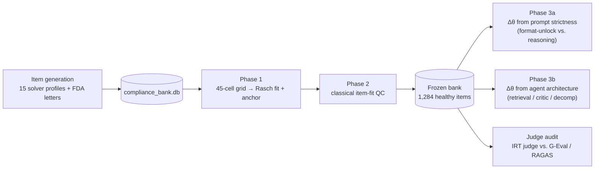
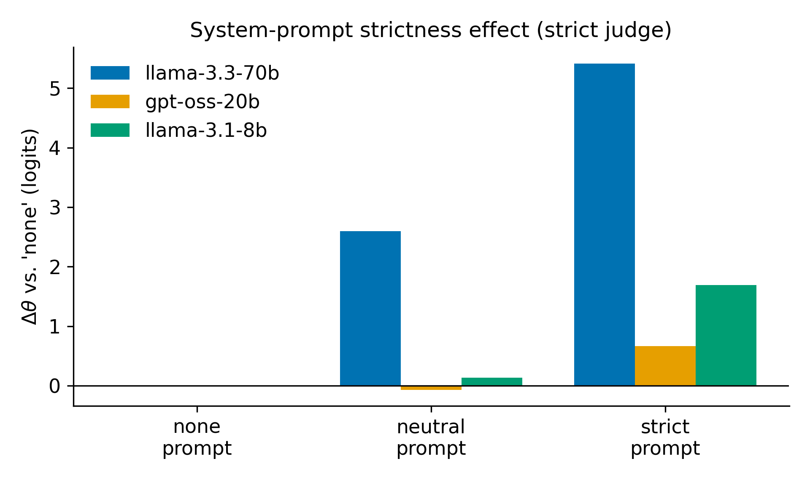

# BIO_Compliance_IRT

[](https://github.com/realizeit7/BIO_Compliance_IRT/actions/workflows/ci.yml)
[](https://www.python.org/)
[](LICENSE)

Automated bio-compliance IRT item bank builder and LLM evaluation framework. Generates
biopharma regulatory compliance scenarios, calibrates item difficulty with Rasch IRT, and
uses calibrated ability θ as an optimization metric for evaluating LLMs.

> **Why it matters:** Standard LLM benchmarks report a single accuracy number and cannot
> tell a genuinely hard question apart from a model that happens to be weak. Item Response
> Theory separates *item difficulty* (`b`) from *model ability* (`θ`) on the same scale — so
> a benchmark stays meaningful as models improve, and "this model is better" becomes a
> measurable, difficulty-controlled claim. This project builds such a calibrated benchmark
> for a domain where correctness genuinely matters: FDA/biopharma regulatory compliance.

> **No API key? Nothing to run.** Every result below is committed to the repo. Open
> **[`analysis.ipynb`](analysis.ipynb)** — GitHub renders it inline with all figures baked in
> (bank composition, item-difficulty fit, Δθ tables, judge-audit AUCs), so you can read the
> findings in the browser with zero setup and zero Groq calls. The full pipelines are
> reproducible from scratch with a key; the *findings* are inspectable without one.

> **Preprint in preparation.** A companion write-up (IRT bank construction + the Δθ
> strictness/architecture analyses) is drafted on the
> [`paper`](https://github.com/realizeit7/BIO_Compliance_IRT/tree/paper) branch. It is kept
> off `main` so the default branch stays focused on code and reproducible results.

## What it does

Two parallel pipelines share a SQLite item bank:

1. **Legacy bank pipeline** — generates compliance items (15 synthetic solver profiles,
   pass-rate → logit-b), persists to `compliance_bank.db`. Also ingests real FDA warning
   letters via `fda_importer.py`.
2. **Phase 1–3 calibration pipeline** — reads `compliance_bank.db` (read-only), runs a
   45-cell virtual-examinee grid (3 models × 5 temperatures × 3 strictness levels), fits
   Rasch (1PL) via `girth`, applies classical item-fit QC, and freezes a healthy bank.
   Phase 3a measures Δθ from system-prompt strictness (format-unlock vs. genuine reasoning gain).
   Phase 3b tests architectural interventions: Retrieval (+1.07), Critic (+3.45), and
   StepDecomposition (+4.55) agents on the 70b model under lenient scoring.
3. **Judge calibration audit** — compares the IRT judge against DeepEval G-Eval and RAGAS
   on 400 Phase 3b responses. G-Eval strict AUC=0.838 vs IRT verdict; RAGAS faithfulness
   AUC≈0.530 (near chance — groundedness ≠ correctness).

## Pipeline at a glance



Every stage is resumable and writes committed JSONL/JSON outputs, so any downstream analysis
can be re-run offline from the frozen artifacts.

## Quick start

**Requirements:** Python 3.10+, Groq API key.

```bash
# Create and activate venv
python3 -m venv venv
source venv/bin/activate
pip install -e .
# For the judge calibration audit (DeepEval / RAGAS), also install its extras:
#   pip install -e ".[judge_audit]"

# Set Groq API key
export GROQ_API_KEY=gsk_...
# or: echo "GROQ_API_KEY=gsk_..." > .env && export $(cat .env | xargs)

# Legacy pipeline — generate 5 hard + 2 easy tasks
python3 main.py --n 5 --easy-n 2

# Phase 1 calibration — full run from configs/phase1_baseline.yaml (~164k Groq calls)
python3 run_phase1.py

# Phase 1 smoke test (3 items × 45 examinees)
python3 run_phase1.py --smoke

# Phase 2 QC — freeze the bank
python3 run_phase2.py

# Phase 3a — Δθ from prompt strictness (offline, no new solver calls)
python3 run_phase3.py

# Phase 3b — agent-variant grid (RetrievalAgent, CriticAgent, StepDecompositionAgent)
# Build CFR embedding index first (one-time, ~22 MB)
python3 scripts/build_cfr_index.py
python3 run_phase3b.py --smoke   # 3 items × 16 cells
python3 run_phase3b.py           # full run (~41k solver + ~20k judge calls)

# Judge calibration audit — IRT judge vs G-Eval vs RAGAS
python3 run_judge_audit.py --smoke       # 3 items × 1 cell × 4 metrics
python3 run_judge_audit.py               # 100 items × 4 cells (1,600 scores)
python3 run_judge_audit.py --analyze-only  # recompute report from existing scores
```

## Project structure

```
# Legacy bank pipeline (item generator)
main.py                         — CLI entry point
task_generator.py               — LLM generates compliance scenarios (5 hard + 5 easy domains)
calibrator.py                   — 15 solver profiles + judge → pass rate → logit b
legacy_evaluator.py             — LLM-as-judge (strict and lenient modes)
irt_parameters.py               — Rasch math, outcome classification, theta MLE
database.py                     — SQLite persistence
fda_importer.py                 — Real FDA warning letter ingestion
build_bank.sh / build_real.sh   — Background build scripts

# Phase 1–3 calibration pipeline
run_phase1.py                   — Phase 1: 45-cell grid → Rasch fit + anchor
run_phase2.py                   — Phase 2: Rasch refit + classical QC → frozen bank
run_phase3.py                   — Phase 3a: offline Δθ analysis (prompt strictness)
run_phase3_rejudge_lenient.py   — Phase 3a: re-grade responses with lenient judge
run_phase3b.py                  — Phase 3b: agent-variant grid → Rasch θ + Δθ
configs/phase1_baseline.yaml    — 45-cell grid config
configs/phase3b_variants.yaml   — 16-cell agent-variant grid config
agents/                         — ZeroShotAgent + RetrievalAgent + CriticAgent + StepDecompositionAgent
arena/                          — grid generator, item loader, resumable runner
evaluator/                      — Rasch fit, Phase 2 QC, response matrix
harness/                        — GroqClient, Judge, CFRStore
scripts/build_cfr_index.py      — one-time eCFR download + embedding index

# Judge calibration audit
judge_audit/                    — backends, sample builder, metric runner, analysis
run_judge_audit.py              — CLI entry point

# Key outputs
compliance_bank.db                                          — shared SQLite item bank
evaluator/output/phase2_frozen_bank.jsonl                   — 1,284 healthy items (b, pb, infit, outfit)
evaluator/output/phase3a_strictness_deltatheta.json         — Δθ tables (strict + lenient)
evaluator/output/phase3b_agent_deltatheta.json              — Δθ per agent type vs zero-shot
evaluator/output/judge_audit_scores.jsonl                   — 1,600 external metric scores
evaluator/output/judge_audit_report.json                    — AUC, Spearman, slopes
evaluator/output/judge_audit_disagreements.jsonl            — top-40 IRT/G-Eval disagreements

# Documentation
METHODOLOGY.md                  — methodological decision record (13 decisions, A–I)
```

## Tech stack

- **Python 3.10+** with `venv`
- **Groq API** (`https://api.groq.com/openai/v1`) via the `openai` SDK — model `llama-3.3-70b-versatile`
- **girth** — Rasch (1PL) MML fit
- **py-irt** — variational Bayes 1PL with posterior SDs (requires regenerating `responses.jsonl`)
- **SQLite** (stdlib) — no ORM
- **deepeval** (4.0.6) — G-Eval metrics for the judge audit
- **ragas** (0.4.3) + **langchain-openai** (<1) — RAGAS metrics; requires langchain 0.3.x (not 1.x)

## Current bank (Phase 2 frozen)

| | count |
|---|---|
| Input items (Phase 1) | 1,823 |
| Dropped: zero-variance | 308 |
| Dropped: low point-biserial | 155 |
| Dropped: infit > 1.5 | 14 |
| Dropped: outfit > 2.0 | 62 |
| **Frozen (healthy)** | **1,284** |

Healthy-bank medians: b = +1.65, point-biserial = +0.42, infit = 0.87, outfit = 0.66.

## Key results



*Ability shift (Δθ) induced by system-prompt strictness, per model, on the frozen
1,284-item bank — derived entirely from committed data in `evaluator/output/`.*

**Phase 3a — prompt strictness effect (Δθ, strict judge):**

| Model | Δθ none→strict | of which: reasoning gain | format unlock |
|---|---|---|---|
| llama-3.3-70b-versatile | +5.41 | +2.52 | +2.89 |
| openai/gpt-oss-20b | +0.66 | ≈ 0 | +0.89 |
| llama-3.1-8b-instant | +1.69 | ≈ 0 | +1.52 |

System-prompt strictness primarily teaches citation format, not regulatory reasoning. Only the 70b shows a non-trivial reasoning gain.

**Phase 3b — architectural interventions (70b, lenient judge, Δθ vs zero-shot):**

| Agent | Δθ (lenient) | Δθ (strict) |
|---|---|---|
| zero_shot | baseline | baseline |
| retrieval | +1.07 | −0.3 |
| critic | +3.45 | −0.8 |
| step_decomp | +4.55 | −1.2 |

Architectural interventions boost θ under lenient scoring but *reduce* θ under strict citation-requiring scoring — same pattern as Phase 3a: the bottleneck is citation format, not reasoning.

**Judge calibration audit (external metrics vs IRT verdict):**

| Metric | AUC | Takeaway |
|---|---|---|
| G-Eval strict (citation rubric) | **0.838** | Best external proxy for IRT judge |
| G-Eval lenient (conclusion rubric) | 0.731 | Weaker without citation penalty |
| RAGAS answer_correctness | 0.693 | Reasonable, lower than G-Eval |
| RAGAS faithfulness | 0.530 | Near chance — groundedness ≠ correctness |

## What this is — and isn't

Stated plainly, because a benchmark you can't trust the limits of is a benchmark you can't use.

**This is** a reproducible, difficulty-controlled evaluation harness: it separates item
difficulty (`b`) from model ability (`θ`) on one scale, applies real psychometric QC
(point-biserial, infit/outfit) to drop broken items, and cross-checks its own LLM judge
against two independent frameworks (G-Eval, RAGAS) instead of trusting it blindly. The
engineering — resumable 45-cell grids, backward-compatible arena plumbing, committed
artifacts at every stage — is production-shaped.

**This is not** a psychometrically certified instrument. Known limits, by design:

- **Closed loop.** The same model family generates, solves, and judges items. The judge audit
  defends *"is the judge internally sane"* (G-Eval strict AUC=0.838), but not external validity.
- **No human ground truth yet.** Gold standards are LLM-authored. A 50-item stratified sample
  is scaffolded in `expert_review/` for compliance-professional labeling; labels are pending.
  This is the single highest-value next step.
- **15 profiles ≠ 15 independent examinees.** They share a base model, so they are correlated;
  real IRT calibration wants hundreds of independent test-takers. `b` values are informative
  but currently lack posterior standard errors on the real bank (the py-irt path in
  `evaluator/pyirt_fit.py` is wired but needs a `responses.jsonl` regeneration to run).
- **Domain coverage is uneven.** Promotional-review real items are absent (OPDP letters use a
  different URL structure); the hard-item template skews violation-by-design.

See [`METHODOLOGY.md`](METHODOLOGY.md) for the full decision record and [`CLAUDE.md`](CLAUDE.md)
§8 for the unabridged self-assessment.

## License

MIT
